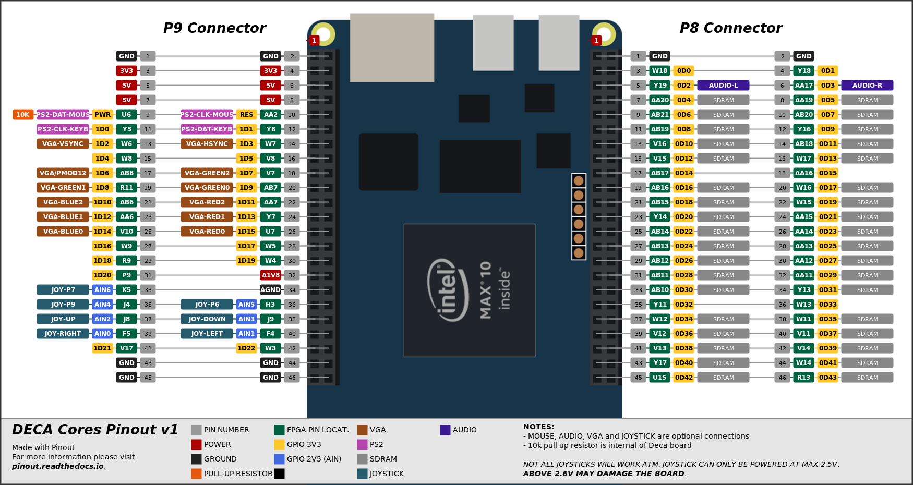

# xxxxxxxxxxx DeMiSTified

22/09/21 DECA port DeMiSTified by somhic from original MiST xxxxx core https://github.com/mist-devel/xxxxxxx.   

Special thanks to Alastair M. Robinson creator of [DeMiSTify](https://github.com/robinsonb5/DeMiSTify) for helping me. 

[Read this guide if you want to know how I DeMiSTified this core](https://github.com/DECAfpga/DECA_board/tree/main/Tutorials/DeMiSTify).

Original module sound errors and signed/unsigned troubles have been arranged thanks to @rampa069.

**Features:**

* HDMI video output (special resolution will not work on all LCD monitors)
* VGA 444 video output is available through GPIO (see pinout below). 
* Audio Line out (3.5 jack green connector) and HDMI audio output
* PWM audio is available through GPIO (see pinout below)
* Joystick available through GPIO  (see pinout below).  **Joystick power pin must be 2.5 V**
  * **DANGER: Connecting power pin above 2.6 V may damage the FPGA**
  * This core was tested with a Megadrive 6 button gamepad. A permanent high level is applied on pin 7 of DB9, so only works buttons B and C.

**Additional hardware required**:

- SDRAM module. Tested with 32 MB SDRAM board for MiSTer (extra slim) XS_2.2 ([see connections](https://github.com/SoCFPGA-learning/DECA/tree/main/Projects/sdram_mister_deca))
- PS/2 Keyboard connected to GPIO  (see pinout below)

##### Versions:

v0.1 VGA version only. 

### Instructions to compile the project for a specific board:

(Note that sof/svf files are already included in /deca/output_files/)

```sh
git clone https://github.com/DECAfpga/xxxx
cd xxxx
#Do a first make (will finish in error). It will download missing submodules 
make
#when asked just accept default settings with Enter key
#Create file site.mk in DeMiSTify folder 
cd DeMiSTify
cp site.template site.mk
#Edit site.mk and add your own PATHs to Quartus (Q19)
gedit site.mk
#[OPTIONAL STEP only needed if main branch is outdated]
git checkout somhic
#Go back to root folder and do a make with board target (deca, neptuno, uareloaded). If not specified it will compile for all targets.
cd ..
make BOARD=deca
```

After that you can:

* Flash bitstream directly from [command line](https://github.com/DECAfpga/DECA_binaries#flash-bitstream-to-fgpa-with-quartus)
* Load project in Quartus from /deca/gameboy_deca.qpf

### Pinout connections:



Mouse is not required to use this core

For 444 video DAC use all VGA pins. For 333 video DAC connect MSB from addon to MSB of location assignment (e.g. connect pin VGAR2 from Waveshare addon to VGA_R[3] Deca pin).

**Others:**

* Button KEY0 is a reset button

### STATUS

* Working fine

* HDMI video outputs special resolution so will not work on all monitors. 

### OSD Controls

* F12 show/hide OSD 
* The reset button KEY0 resets the controller (so re-initialises the SD card if it's been changed, reloads any autoboot ROM.) The OSD Reset menu item resets the core itself.


### Follows original core README.md:

